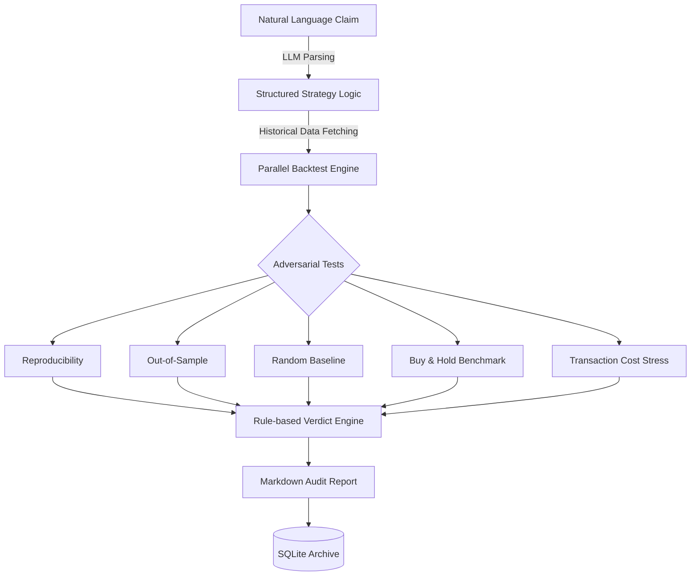

# 🧠 Cogito: CI/CD for Trading Ideas

[](https://pypi.org/project/cogito/)
[](https://opensource.org/licenses/MIT)
[](https://www.python.org/downloads/)
[](https://github.com/Om7035/cogito/actions)

**Stop trading on vibes. Start auditing with data.** Cogito is an adversarial research partner that deconstructs natural language trading claims and subjects them to a battery of stress tests to expose overfitting and backtest bias.

---

## 🚀 Demo

Audit a strategy directly from your terminal:

```bash
cogito audit "Buy AAPL on the first trading day of the month and sell after 5 days" --non-interactive
```

**Result Snippet:**
```markdown
# 📊 Audit Report: Strategy Confidence - MEDIUM
> Verdict: The strategy is profitable but highly sensitive to transaction costs.

### ✅ Evidence
- **Reproducibility**: Passed. The logic generated 16 trades with a 69.44% return.
- **Random Baseline**: Passed. Outperformed 1,000 random entry/exit simulations.
- **Transaction Costs**: FAILED. 0.1% fee/trade reduced total alpha by 40%.
```

---

## 📉 Why Cogito Exists?

In the world of quantitative finance, **the easiest person to fool is yourself.** 

Most trading strategies found on YouTube or social media suffer from **backtest overfitting**: they look great on historical data only because the rules were cherry-picked to fit a specific noise pattern. Cogito acts as the "CI/CD pipeline" for your ideas, automatically running the adversarial tests that most retail traders skip.

---

## 🛠 How It Works

Cogito uses a multi-stage pipeline to transform a thought into an evidence-based verdict.



---

## ⚙️ Installation

### From Source (Recommended for Developers)
1. Clone the repository:
   ```bash
   git clone https://github.com/Om7035/cogito.git
   cd cogito
   ```
2. Create and activate a virtual environment:
   ```bash
   python -m venv .venv
   source .venv/bin/activate  # On Windows: .venv\Scripts\activate
   ```
3. Install dependencies in editable mode:
   ```bash
   pip install -e .
   ```

### Configuration
Create a `.env` file in the root directory:
```env
OPENAI_API_KEY=your-openai-key
# Optional: Use local models via Ollama
# OPENAI_BASE_URL="http://localhost:11434/v1"
```

---

## 🕹 Usage

### Basic Audit
Run an interactive audit where you select which stress tests to apply:
```bash
cogito audit "Buy BTC on Monday and sell on Friday"
```

### Automation & Flags
- `--non-interactive`: Run all 5 tests automatically without prompting.
- `--verbose`: Show detailed logs of data fetching and calculation steps.
- `--clear-cache`: Purge the Parquet data cache before running.
- `--agentic`: (Experimental) Enable AI-reflection to propose and test improvements.

---

## 🧪 The Five Adversarial Tests

1. **Reproducibility**: Verifies the logic creates consistent signals and profitable returns on the primary dataset.
2. **Out-of-Sample (OOS)**: Splits the data (70% in-sample / 30% out-of-sample). If the strategy fails on the 30% it hasn't seen, it's likely overfitted.
3. **Random Baseline**: Compares your return against 1,000 random entry/exit dates. Catch strategies that yield "lucky" returns.
4. **Buy & Hold**: Benchmarks you against a simple passive holding. If you can't beat the index, the strategy adds no value.
5. **Transaction Costs**: Reruns the strategy with a fixed 0.1% fee/trade. Essential for high-frequency or retail-sized ideas.

---

## 🏗 Architecture

- **`cogito/parser.py`**: Deconstructs NL claims into structured parameters using GPT-4.
- **`cogito/backtest.py`**: The core multi-asset engine (supports Portfolio Rebalancing).
- **`cogito/agent.py`**: Agentic loop for strategy self-improvement.
- **`cogito/db.py`**: SQLite persistent storage for audit history.
- **`app.py` & `app_api.py`**: Streamlit UI and FastAPI backend and service layers.

---

## 🗺 Roadmap

- [ ] **Crypto Support**: Fully integrate CCXT/Binance for 24/7 crypto auditing.
- [ ] **Agentic Tree Search**: Let the AI propose 10+ variations of a strategy automatically.
- [ ] **Factor Investing**: Support for Value, Momentum, and Quality factors.
- [ ] **Docker Sandboxing**: Secure execution environment for user-supplied code.

---

## 🤝 Contributing

We welcome community contributions! Please see [CONTRIBUTING.md](CONTRIBUTING.md) for details on adding new tests or data sources.

---

## ⚠️ Limitations

- **Asset Scope**: Currently optimized for Equities (YFinance) and basic Crypto.
- **Parsing**: Extremely complex or ambiguous claims (e.g., "sell when I feel bad") will fail parsing.
- **Models**: Does not currently support training/validation of ML/Deep Learning models.

---

## 📜 License

Distributed under the **MIT License**. See `LICENSE` for more information.

---

## 🙏 Acknowledgements

- Inspired by **Dexter** and **AI-Scientist-v2** research into autonomous quantification.

---

## ❓ FAQ

**Q: Do I need an OpenAI key?**  
A: To parse natural language claims, yes. However, you can use local models via Ollama by setting the `OPENAI_BASE_URL` in your `.env`.

**Q: Is the data cached?**  
A: Yes. Cogito saves fetched data as Parquet files in the `cache/` directory to save time and API limits.

**Q: How accurate is the audit?**  
A: Cogito provides *statistical evidence*, not financial advice. A "High Confidence" verdict means the strategy is statistically robust, not that it is guaranteed to make money.
